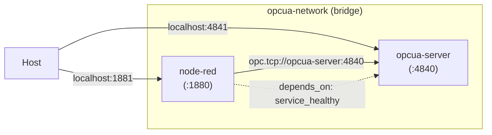
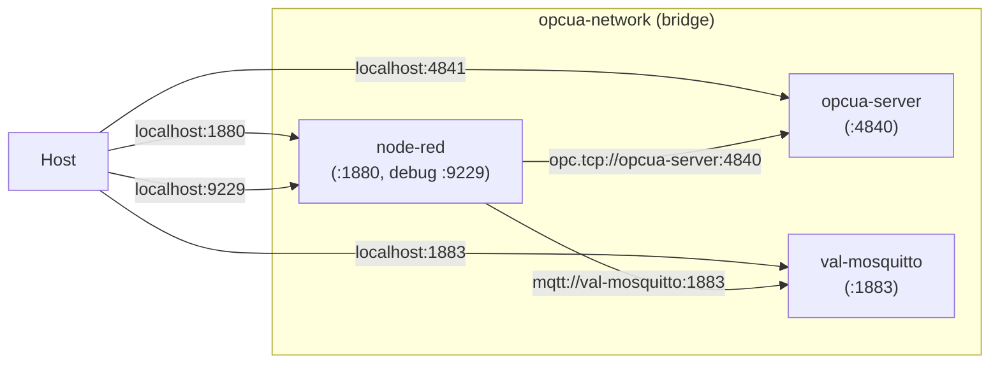

# Docker Deployment Guide

The compose stack runs two containers on a private `opcua-network` bridge:



Inside the network the nodes reach the server at `opc.tcp://opcua-server:4840`;
the host sees them on the remapped ports `1881` / `4841`. Node-RED starts only
once `opcua-server` passes its healthcheck (a TCP probe of port 4840).

## Quick Start

```bash
docker compose build
docker compose up -d
```

Node-RED available at **http://localhost:1881**, OPC UA test server at `opc.tcp://localhost:4841`.

## Prerequisites

- Docker >= 20.10
- Docker Compose >= 2.0

## Commands

### Makefile

```bash
make build      # Build Docker image
make up         # Start containers
make down       # Stop containers
make logs       # Show logs
make restart    # Restart containers
make clean      # Remove containers and volumes
make status     # Show container status
make shell      # Open shell in container
```

### Docker Compose

```bash
docker compose build                # Build
docker compose up -d                # Start (background)
docker compose down                 # Stop
docker compose logs -f              # Follow logs
docker compose restart              # Restart
docker compose ps                   # Status
```

## Configuration

### Ports

Default: Node-RED on port **1881**, OPC UA test server on **4841**. Change in `docker-compose.yml`:

```yaml
ports:
  - "1880:1880"  # external:internal
```

### Volumes

- `./data` — Node-RED user data (flows, credentials)

### Environment Variables

```yaml
environment:
  - NODE_OPTIONS=--max-old-space-size=512
  - TZ=Europe/Berlin
```

## Development Mode

```bash
docker compose -f docker-compose.dev.yml up -d
```

Source directories (`nodes/`, `lib/`) are mounted as volumes — changes are visible after Node-RED restart.

The dev stack adds a third container the plain stack does not have:



`val-mosquitto` is an anonymous `eclipse-mosquitto` broker. Its **service name
is load-bearing**: the validation flows `13 - PubSub Full Validation` and
`14 - Full Suite Validation` address it as `mqtt://val-mosquitto:1883`, and it
is the compose *service* name — not the container name — that resolves inside
the network. Renaming the service breaks the MQTT PubSub tabs (T2, T3); the
container name is free to change.

Node-RED waits for `opcua-server` to report **healthy** before it starts, so
the first deploy no longer races the OPC UA server's startup.

## Troubleshooting

### Container won't start

```bash
docker compose logs          # Check logs
docker compose up            # Run in foreground
```

### Port already in use

Change port in `docker-compose.yml` or find the process:

```bash
lsof -i :1881
kill <PID>
```

### Native module issues

```bash
docker compose build --no-cache    # Full rebuild
```

### `Cannot find private key … private_key.pem` on the very first start

Seen only on a **brand-new Node-RED user directory**, when a flow containing
several `opcua-endpoint` config nodes and/or an `opcua-server` node is deployed
before node-opcua has written its default self-signed certificate. Each OPC UA
instance asks node-opcua's default certificate manager to create that
certificate in the same shared PKI folder at the same moment; one wins and the
others read a key that is not on disk yet. Symptoms are an
`Error starting server` on the embedded server node and
`Initial connect failed` on the clients.

It is a first-run-only race and it does not repeat: once the certificate
exists, **restarting Node-RED clears it permanently**.

```bash
docker compose restart node-red
```

To avoid it entirely on a fresh volume, start the stack once and let it settle
before deploying a multi-endpoint flow.

### `opcua-server` shows as `unhealthy`

Fixed in the shipped compose files. The `opcua-server` service reuses the
`nodered/node-red` image but replaces the entrypoint with the OPC UA test
server, so it used to inherit that image's `HEALTHCHECK` — a probe of
Node-RED's HTTP port, which nothing in that container ever answers. Both
compose files now override it with a TCP probe of port 4840. If you build a
derived compose file, carry the `healthcheck:` block over, or `depends_on:
condition: service_healthy` will wait forever.

### Data persistence

The `data/` directory is mounted as a volume. `docker compose down` preserves data. To also remove data: `docker compose down -v`.

## Production

1. **HTTPS**: Use a reverse proxy (nginx, traefik) with SSL
2. **Credentials**: Use Docker secrets
3. **Backup**: Regular backups of `./data`
4. **Monitoring**: Set up log aggregation
