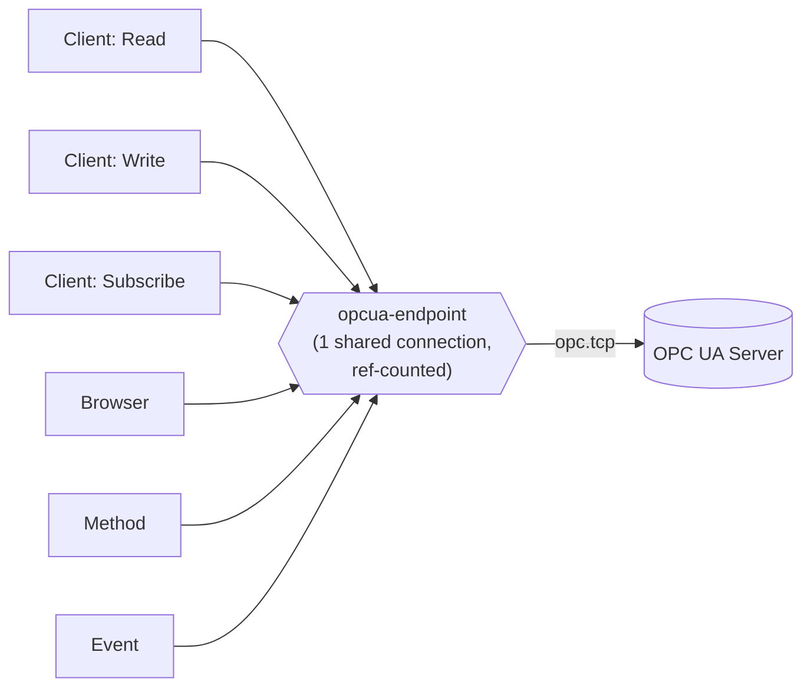
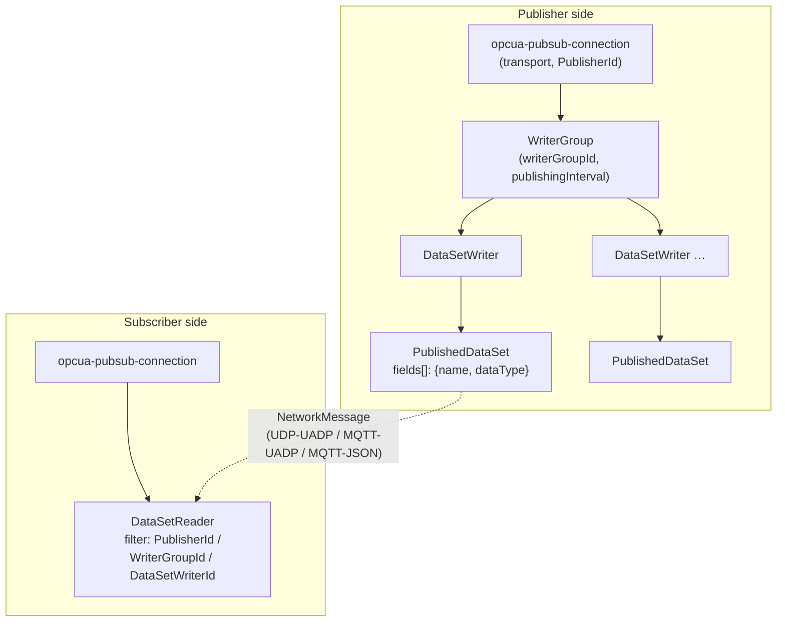
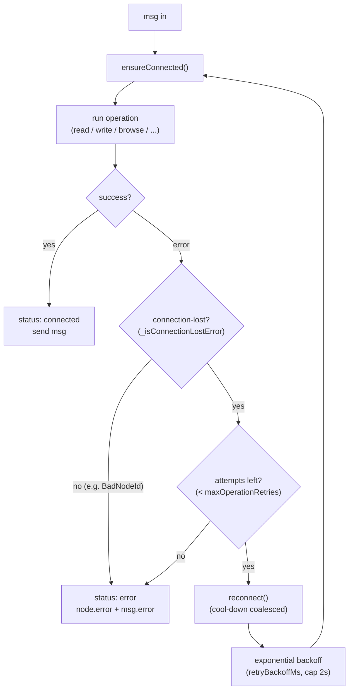
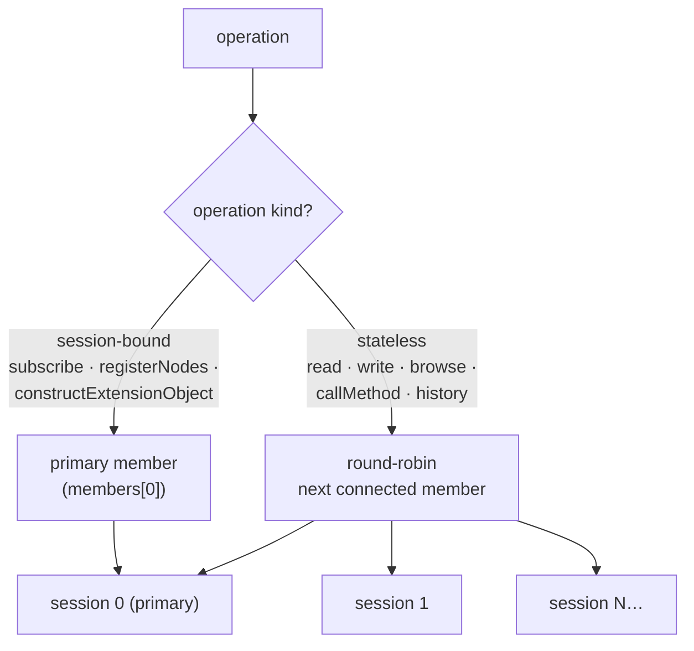

# node-red-contrib-opcua-suite

An OPC UA suite for Node-RED.

## Features

- **Shared connections** — All nodes referencing the same endpoint share one TCP connection (ref-counted)
- **Batch read/write** — Single OPC UA service call via `msg.items` or payload object
- **Item collector** — Chain `opcua-item` nodes visually for batch operations
- **Drag & drop certificates** — Upload certs directly in the editor UI
- **Reconnect handling** — `keepSessionAlive` + session recovery + connection fallback
- **All-in-one client** — Read, write, subscribe, browse, method, history in one node
- **ExtensionObject support** — Read/write structured types with automatic serialization
- **Discovery** — `getendpoints`, `registernodes`, `translatebrowsepath`
- **Status propagation** — Shared endpoint broadcasts connection state to all nodes
- **OPC UA PubSub** — `opcua-publisher` / `opcua-subscriber` worker nodes over UDP-UADP multicast or MQTT (UADP or JSON), with cyclic/KeepAlive and msg-driven publishing — see [OPC UA PubSub](#opc-ua-pubsub)

## Installation

```bash
cd ~/.node-red
npm install node-red-contrib-opcua-suite
```

## Quick Start

### 1. Read a variable

```
[inject] → [OPC UA Client] → [debug]
```

Set `msg.topic` to a NodeId (e.g. `ns=2;s=Temperature`) in the inject node. Set the client's default operation to **Read**. Done.

### 2. Batch read multiple variables

```
[inject] → [Item: Temp] → [Item: Pressure] → [OPC UA Client] → [debug]
```

Each **OPC UA Item** node adds its variables to `msg.items`. The client reads them all in **one** OPC UA service call. No function node needed.

### 3. Write a value

```
[inject] → [OPC UA Client] → [debug]
```

Set `msg.payload` to the value (e.g. `25.5`) and `msg.topic` to the NodeId in the inject node. Set the client's default operation to **Write**. DataType is auto-detected from the JS type.

### 4. Subscribe to live changes

```
[inject] → [OPC UA Client] → [debug]
```

Set `msg.topic` to the NodeId and the client's default operation to **Subscribe**. Click inject once — every value change on the server produces a new message.

> Import ready-to-use flows from **Menu → Import → Examples → node-red-contrib-opcua-suite**.

## Nodes

### opcua-endpoint (Config Node)

Shared connection configuration. All nodes referencing the same endpoint share **one** TCP connection (ref-counted: connected on first node, disconnected when the last node closes).



With **Session Pool** > 1 the endpoint holds N sessions instead of one — see [Session pool routing](#session-pool-routing).

| Field | Description |
|---|---|
| Endpoint URL | `opc.tcp://localhost:4840` |
| Security Mode | None, Sign, SignAndEncrypt |
| Security Policy | None, Basic128Rsa15, Basic256, Basic256Sha256, Aes128/Aes256 |
| Username / Password | Optional credentials |
| Certificates | Drag & drop upload for client cert, private key, CA cert, X509 user token |
| Session Pool | Number of sessions (default 1 = single shared session). `>1` round-robins stateless reads/writes/browse across N sessions; subscriptions & registered nodes stay on the primary. Only helps when a single session is the bottleneck — see [Benchmark](#benchmark--stress-test). |

Authentication priority: X509 User Token > Username/Password > Anonymous.

### opcua-client (All-in-One)

Single node for all OPC UA operations. Set via `msg.operation` or the default operation in the node config.

| Operation | msg.topic / msg.nodeId | msg.payload | Description |
|---|---|---|---|
| `read` | NodeId | — | Read a single variable |
| `readmultiple` | — | — | Read all items in `msg.items` |
| `write` | NodeId | Value to write | Write a single variable |
| `writemultiple` | — | — | Write all items in `msg.items` |
| `subscribe` | NodeId | — | Subscribe to value changes |
| `unsubscribe` | NodeId | — | Stop subscription |
| `browse` | NodeId (default: RootFolder) | — | Browse address space |
| `method` | — | Input arguments | Call a method (needs `msg.objectNodeId` + `msg.methodNodeId`) |
| `history` | NodeId | — | Read historical values (needs `msg.startTime` + `msg.endTime`) |
| `getendpoints` | — | — | Discover server endpoints |
| `readattribute` | NodeId | — | Read BrowseName, DisplayName, etc. |
| `registernodes` | — | — | Register nodes for fast access |
| `translatebrowsepath` | — | Browse path | Translate browse path to NodeId |

When `msg.items` is present, the client automatically switches to batch mode — even if the operation is set to `read` or `write`.

Every output (including the error output) carries the resolved operation in `msg.operation` — `"read"`, `"write"`, `"browse"`, … (lower-cased), or the more specific `"readmultiple"` / `"writemultiple"` when a batch ran — so a downstream **switch** node can branch on it.

**Advanced settings** (resilience): the client connects on deploy (**Connect on deploy**, default on) so its status reflects the real connection immediately. On a connection-lost error each message is retried up to **Operation Retries** times (default 3) with exponential **Retry Backoff** (default 100 ms, capped at 2 s) — see [Resilience hardening](#resilience-hardening-implemented).

### opcua-item (Item Collector)

Defines OPC UA items (variables) for batch operations. Each item needs a **NodeId** and optionally a **Name** and **DataType**.

**Chain pattern** — multiple Item nodes in series, each adds to `msg.items`:
```
[inject] → [Item: Temp] → [Item: Pressure] → [Item: Speed] → [Client]
```

**List pattern** — all items in a single node:
```
[inject] → [Item: Temp, Pressure, Speed] → [Client]
```

In **Collector Mode** (default), items are appended to `msg.items` for batch operations. In **Legacy Mode** (collector off), only the first item is set on `msg.topic` / `msg.datatype` for single operations.

**DataType** (per item, write-only) covers the full OPC UA type set: booleans/integers (`Boolean`, `SByte`/`Byte`, `Int16`–`Int64`, `UInt16`–`UInt64`), floating point (`Float`, `Double`), text/time (`String`, `DateTime`, `LocalizedText`, `QualifiedName`, `XmlElement`), binary/identifier types (`ByteString`, `Guid`, `NodeId`, `ExpandedNodeId`, `StatusCode`), the structured `ExtensionObject`, and an *Advanced (rarely writable)* group (`DataValue`, `Variant`, `DiagnosticInfo`, offered for completeness — incompatible values surface a server write error). The DataType is only used for writes — reads always return the server's type. Leave it on **Auto** to let node-opcua infer the type from the JS value.

**Array (`[]`)** — tick the per-item `[]` box to write the value as an array (ValueRank); the payload must be a JS array (e.g. `[1, 2, 3]`). Sets `arrayType: "Array"` on the item (or `msg.arrayType` for a single write).

**ExtensionObject** — selecting `ExtensionObject` reveals a **DataType NodeId** field (e.g. `ns=2;i=3003`); the payload is a plain JSON object of the struct fields. See [ExtensionObjects](#extensionobjects-structured-types).

**Operation** (optional) sets `msg.operation` (Read / Write / Subscribe / Unsubscribe) so the downstream client knows what to do without a separate config — leave on *don't set* to keep the client's default or an existing `msg.operation`.

**Unwrap single value** sets `msg.unwrapSingle = true`. When a read resolves to exactly one item, the client delivers the scalar value in `msg.payload` (e.g. `false`) instead of a one-element array (`[{value:false, …}]`). The same option also exists on the client node; see [Single-value reads](#single-value-reads).

### opcua-browser

Browses the OPC UA address space. Send a NodeId via `msg.topic` to browse from that node, or leave empty to start from `RootFolder`.

| Input | Description |
|---|---|
| `msg.topic` / `msg.nodeId` | Starting NodeId (default: `RootFolder`) |
| `msg.recursive` | Set to `true` for recursive browsing |

Output: `msg.payload` contains an array of references with `browseName`, `nodeId`, `nodeClass`, and `typeDefinition`.

### opcua-browse-client

Interactive address space browser with an **editor tree view**. Select variables visually in the editor, then read or subscribe to them at runtime. No NodeIds to type — just click.

Modes:
- **Read** — trigger via inject to read all selected items
- **Subscribe** — automatically subscribes on deploy, emits a message per value change

### opcua-method

Calls an OPC UA method. Configure the **Object NodeId** and **Method NodeId** in the node or pass them via `msg.objectNodeId` / `msg.methodNodeId`.

Input arguments via `msg.payload` as an array:
```json
[{"dataType": "Double", "value": 3.14}, {"dataType": "String", "value": "hello"}]
```

Or simple values (datatype auto-detected): `[3.14, "hello", true]`

Output: `msg.payload` = array of return values, `msg.statusCode` = method status.

### opcua-event

Subscribes to OPC UA events and alarms.

| Config | Description |
|---|---|
| Source NodeId | Node to monitor (default: `i=2253` — Server node) |
| Event Type | e.g. `BaseEventType`, `AlarmConditionType` |

Send `msg.action = "subscribe"` to start, `msg.action = "unsubscribe"` to stop. Each event produces a message with `eventType`, `severity`, `message`, `time`, and `sourceName`.

### opcua-server

Embedded OPC UA server. Starts automatically on deploy. Build the address space at runtime via `msg.command`:

| Command | Required fields | Description |
|---|---|---|
| `addFolder` | `msg.folderName` | Create a folder in the address space |
| `addVariable` | `msg.variableName`, `msg.datatype` | Add a variable (optional: `msg.initialValue`) |
| `addObject` | `msg.objectName` | Add an object node |
| `addMethod` | `msg.methodName`, `msg.parentNodeId` | Add a callable method under an object node (optional: `msg.inputArguments`, `msg.outputArguments`, `msg.func`) |
| `setValue` | `msg.nodeId`, `msg.payload` | Update a variable's value |
| `setWritable` | `msg.nodeId` | Make a variable writable by clients |
| `deleteNode` | `msg.nodeId` | Remove a node |
| `raiseEvent` | `msg.sourceNodeId`, `msg.message` | Raise an event |
| `getServerInfo` | — | Get session count, endpoint URL, server state |

### opcua-pubsub-connection (Config Node)

Shared PubSub transport configuration. Picks the transport (**UDP** multicast or **MQTT**), the PublisherId, and (for MQTT) the broker URL / topic prefix / QoS. The `opcua-publisher` and `opcua-subscriber` nodes reference it and share one ref-counted transport. See [OPC UA PubSub](#opc-ua-pubsub) for the full configuration hierarchy.

### opcua-publisher

Publishes a DataSet over the referenced `opcua-pubsub-connection`. Declares a WriterGroup with one or more DataSetWriters. **Acyclic** (default): each input `msg.payload` field map becomes one NetworkMessage. **Cyclic**: publishes at `PublishingInterval`, sending a KeepAlive when no value changed. See [OPC UA PubSub](#opc-ua-pubsub).

### opcua-subscriber

Receives DataSets over the referenced `opcua-pubsub-connection`. Declares a DataSetReader filtering on PublisherId / WriterGroupId / DataSetWriterId, decodes each NetworkMessage, and emits one `msg` per matched DataSetMessage. A ConfigurationVersion mismatch raises a visible `node.error()`. See [OPC UA PubSub](#opc-ua-pubsub) for the full `msg` shape.

## OPC UA PubSub

PubSub adds broker-less (**UDP-UADP** multicast) and broker-mediated (**MQTT**, UADP or JSON) publish/subscribe alongside the Client/Server nodes. The three shipped combinations are **UDP-UADP**, **MQTT-UADP**, and **MQTT-JSON** — there is **no UDP-JSON** combination. Configuration lives on the `opcua-pubsub-connection` config node (transport, multicast group / broker URL, PublisherId); the `opcua-publisher` and `opcua-subscriber` worker nodes reference it.

### Configuration hierarchy



**Publisher** — `opcua-pubsub-connection` → **WriterGroup** → **DataSetWriter** → **PublishedDataSet**:

- One **WriterGroup** per publisher (`writerGroupId`, `publishingInterval`, `priority`, `maxNetworkMessageSize`).
- One or more **DataSetWriters** (edited as a JSON array in the `writers` field), each bound to one **PublishedDataSet**.
- The PublishedDataSet `fields[]` of `{ name, dataType }` (e.g. `{ "name": "Temperature", "dataType": "Double" }`) type the outgoing values.

**Subscriber** — `opcua-pubsub-connection` → **DataSetReader**:

- The DataSetReader filters on **PublisherId** / **WriterGroupId** / **DataSetWriterId** — at least one is required.
- For **MQTT-JSON** filter on `publisherId` (and optionally `dataSetWriterId`): JSON NetworkMessages carry no `groupHeader`, so `writerGroupId` is unavailable.

### Publisher input

`msg.payload` is an object keyed by field name — `{ <fieldName>: <rawValue> }`. Each declared PublishedDataSet field present in the payload becomes a Variant in one keyframe; **missing fields are omitted, never fabricated**. One inbound `msg` produces one outbound NetworkMessage.

- **Acyclic** (default): publishes once per inbound `msg`.
- **Cyclic**: publishes every `publishingInterval` ms, sending a keyframe when values changed and a **KeepAlive** NetworkMessage when nothing changed since the last tick.

### Subscriber output (msg shape)

Per matched DataSetMessage the subscriber emits one `msg`:

| Field | Description |
|---|---|
| `msg.payload` | `{ [fieldName]: value }` — Variant/DataValue wrappers removed |
| `msg.publisherId` | PublisherId of the source connection |
| `msg.writerGroupId` | WriterGroup id (`undefined` for JSON encoding — no groupHeader) |
| `msg.dataSetWriterId` | DataSetWriter id |
| `msg.sequenceNumber` | NetworkMessage sequence number (DataSetMessage fallback for JSON) |
| `msg.timestamp` | `Date` of the DataSetMessage |
| `msg.statusCode` | 16-bit DataSetMessage **status summary** (`0` = Good), i.e. the Part 14 §7.2.4.5.2 Good/Bad/Uncertain summary — **not** a full 32-bit OPC UA StatusCode |
| `msg.encoding` | `"uadp"` or `"json"` |
| `msg.transport` | `"udp"` or `"mqtt"` |
| `msg.topic` | MQTT only — omitted entirely for UDP |

A matched DataSetMessage whose ConfigurationVersion differs from the optional `expectedConfigVersion` raises a visible `node.error()` and is dropped — it is never silently swallowed.

### Encoding rules

The **UDP** transport carries **UADP** binary NetworkMessages only — selecting JSON over a UDP connection is rejected at startup. **MQTT** allows either UADP or JSON. **UDP-JSON is not a shipped combination**. JSON is the cloud-friendly, self-describing choice (each message carries its own field names and types, no metadata pre-exchange).

### UDP multicast NIC selection

The UDP socket always binds to `0.0.0.0`. Leave `multicastInterface` at `0.0.0.0` to let the OS choose the outgoing NIC. On a **multi-NIC host** the OS may pick the wrong interface for multicast — set `multicastInterface` to the host's IP on the PubSub LAN if datagrams are not received. This field only pins the interface used to join the group and send.

### PubSub examples

See example flows **10 - PubSub UDP-UADP Loopback** (self-contained, no external infra), **11 - PubSub MQTT-UADP**, and **12 - PubSub MQTT-JSON**. Flows 11 and 12 require a local MQTT broker at `mqtt://localhost:1883` (e.g. `docker run -p 1883:1883 eclipse-mosquitto`).

## Reference

See [docs/MSG-SCHEMA.md](docs/MSG-SCHEMA.md) for the full message field reference.

### NodeId Formats

| Format | Example |
|---|---|
| String | `ns=2;s=MyVariable` |
| Numeric | `ns=2;i=1234` |
| GUID | `ns=2;g=550e8400-e29b-...` |
| Short | `i=84`, `s=MyVar` (ns=0) |
| Well-known | `RootFolder`, `ObjectsFolder`, `TypesFolder`, `Server` |

### DataType Auto-Detection

| JS Type | OPC UA DataType |
|---|---|
| `boolean` | Boolean |
| integer `number` | Int32 |
| float `number` | Double |
| `string` | String |
| `Date` | DateTime |

Explicit override: `msg.datatype = "UInt16"` or in item config. The item node's **DataType** dropdown offers the full OPC UA scalar set (see [opcua-item](#opcua-item-item-collector)); the override applies to writes only.

### Single-value reads

A read that resolves to **exactly one item** — one Item node, or a single-entry `msg.items` — returns a one-element array in `msg.payload` by default (`[{value:false, …}]`), because the client treats `msg.items` as a batch read.

Enable **Unwrap single value** on the client node (or set `msg.unwrapSingle = true`, e.g. via the item node's checkbox) to receive the scalar value directly in `msg.payload`, with its metadata (`dataType`, `statusCode`, `nodeId`, `sourceTimestamp`, `serverTimestamp`) flattened onto `msg`. `msg.unwrapSingle` overrides the node setting per message; reads of two or more items are never unwrapped.

### ExtensionObjects (Structured Types)

**Reading:** ExtensionObjects are automatically serialized to plain JSON in `msg.payload`. The `msg.dataType` will be `"ExtensionObject"` with a `_typeName` field.

**Writing:** Set `msg.datatype = "ExtensionObject"` and `msg.dataTypeNodeId` to the DataType definition NodeId:
```json
{
    "topic": "ns=2;s=MyStructVar",
    "datatype": "ExtensionObject",
    "dataTypeNodeId": "ns=2;i=3003",
    "payload": { "temperature": 25.5, "unit": "Celsius" }
}
```

## Examples

Import ready-to-use flows in the Node-RED editor: **Menu → Import → Examples → node-red-contrib-opcua-suite**.

Available examples:
1. **Read Single Variable** — inject → client → debug
2. **Batch Read with Item Collector** — inject → item → item → client → debug
3. **Write a Value** — inject → client → debug
4. **Subscribe to Changes** — inject → client → debug
5. **Browse Address Space** — inject → browser → debug
6. **Event Subscription** — inject → event → debug
7. **Call a Method** — inject → method → debug
8. **Server with Variables** — inject → server → debug
9. **Session Retry Test** — inject → client → debug
10. **PubSub UDP-UADP Loopback** — self-contained, no external infra
11. **PubSub MQTT-UADP** — requires a local MQTT broker
12. **PubSub MQTT-JSON** — requires a local MQTT broker

All examples work **without function nodes**.

Two comprehensive, self-asserting **validation flows** also live in the GitHub repo (not shipped in the npm package — they target the bundled Docker test stack): `13 - PubSub Full Validation` (9 PubSub scenarios: every transport × encoding, multi-writer, cyclic/KeepAlive, chunking, filtering, ConfigurationVersion mismatch) and `14 - Full Suite Validation` (24 tabs exercising **every** node — client read/write/subscribe/browse/method, item collector, browser, browse-client, method, event, embedded server, authentication, plus all PubSub scenarios). Each tab emits a `[VALIDATE] … PASS/FAIL` line. Run them against `docker compose -f docker-compose.dev.yml up`.

## Docker

```bash
docker compose up -d          # Start Node-RED + OPC UA test server
# Node-RED: http://localhost:1881
# Test server: opc.tcp://localhost:4841

docker compose build --no-cache && docker compose up -d --force-recreate  # Rebuild
```

## Testing

```bash
npm test                  # 120 unit tests
node test/live-integration.js  # 36 live integration tests (requires Docker)
```

## Benchmark & Stress Test

Drives the real `OpcUaClientManager` (the engine behind `opcua-client`) against
the bundled test server and reports throughput, latency percentiles (p50/p95/p99),
and error counts under sustained concurrent load. The test server is started
automatically. Phases:

- **Throughput/latency** — `read` (sequential + concurrent), `readMultiple`, `write`
- **Resilience** — connect/disconnect churn (lifecycle leaks) and reconnect
  under load (forced session loss mid-stream, measures recovery rate)
- **Subscribe stress** — N monitored items @100 ms, counts notifications +
  item/teardown errors

```bash
npm run bench             # full run  (5s/phase, 50 concurrent, 200 sub items)
npm run bench:quick       # short run (1.5s/phase) — CI-friendly
```

Tunable via env vars / flags:

```bash
BENCH_DURATION_MS=10000 BENCH_CONCURRENCY=100 BENCH_SUB_ITEMS=500 npm run bench
BENCH_POOL_SIZE=4 npm run bench   # exercise the opt-in session pool
node test-server/benchmark.js --no-spawn --endpoint opc.tcp://host:4840/UA/TestServer
```

Steady-state phases must be error-free or the run exits non-zero (so it doubles
as a load-soak smoke test). The reconnect phase is a deliberate fault-injection
storm — it passes on recovery rate (≥99%) + final connected state. After the
resilience hardening below it now recovers **100% of ops** from forced session
drops in typical runs.

Indicative numbers on an 8-core dev box (node 20):

| Phase | Throughput | Latency |
|-------|-----------|---------|
| read (sequential) | ~1,100 ops/s | p50 ≈ 0.7 ms |
| read (×50 concurrent) | ~6,500 ops/s | p50 ≈ 6 ms, p99 ≈ 20 ms |
| readMultiple (7/call) | ~5,000 ops/s | ≈ 35k values/s |
| write (×50 concurrent) | ~5,500 ops/s | p50 ≈ 7 ms |
| connect/disconnect churn | — | ~60 ms/cycle |
| reconnect under load (4 forced drops) | recovers | 100% ops ok, 0 errors |
| subscribe (200 items) | 127 notif/s | 0 errors |

### Resilience hardening (implemented)

The reconnect-under-load benchmark originally surfaced ~0.2% unrecovered ops
during a forced session-loss storm. The operation path now retries cleanly:



Three fixes:

- **Bounded operation retry** (`opcua-client` node). A connection-lost operation
  is now retried up to `maxOperationRetries` times (default 3) with exponential
  backoff (`retryBackoffMs`, capped at 2 s) instead of exactly once — so a
  second drop landing during the first reconnect no longer fails the message.
- **Reconnect cool-down** (`OpcUaClientManager`). After a successful reconnect,
  a redundant `reconnect()` arriving within `reconnectCooldownMs` (default
  250 ms) while still connected is a no-op, removing the race where a burst of
  callers each forced another teardown+connect that briefly flipped
  `isConnected` to false under other in-flight operations.
- **Wider connection-lost classification.** `_isConnectionLostError()` now also
  recognises the channel-teardown abort ("Transaction has been canceled because
  client channel is being closed") and `BadSessionClosed` / `BadSessionIdInvalid`
  / `BadConnectionClosed` / `BadSecureChannelClosed` status errors, so those are
  retried rather than surfaced as failures.

- **Optional session pool** (implemented, opt-in). The endpoint config node has
  a **Session Pool** field (default 1 = single shared session, unchanged). With
  `poolSize > 1`, stateless operations (read/write/browse/...) round-robin across
  N sessions; session-bound operations (subscriptions, registered nodes) stay on
  the primary member. A pool only raises throughput when a single session/channel
  is genuinely the bottleneck (high-latency links, servers that serialize per
  session) — on a local low-latency server the server/CPU is the limit, so a pool
  shows no gain there. Default behaviour is byte-for-byte unchanged at `poolSize 1`.

#### Session pool routing



Session-bound work keeps its session affinity on the primary; stateless work
spreads across all connected sessions. If no member is connected, the call
falls through to the primary so the retry/reconnect path above kicks in.

### Further ideas

- **`readMultiple` is the throughput win.** One batch call returns ~7× the values
  of a single read at similar latency — prefer it (or subscriptions) over many
  single `read` ops in hot flows.

## License

MIT

## Author

blanpa
